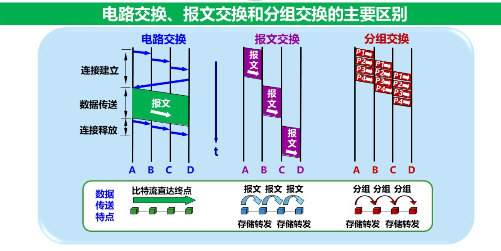
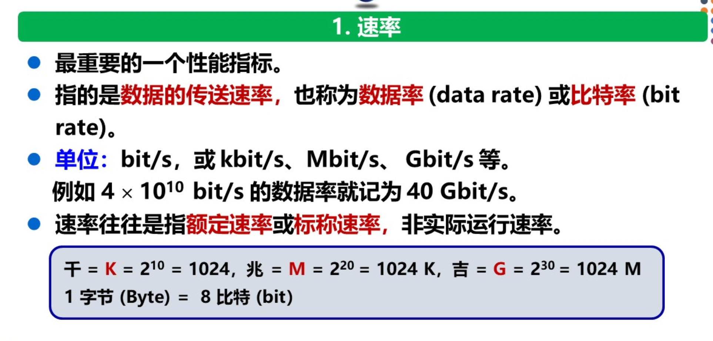
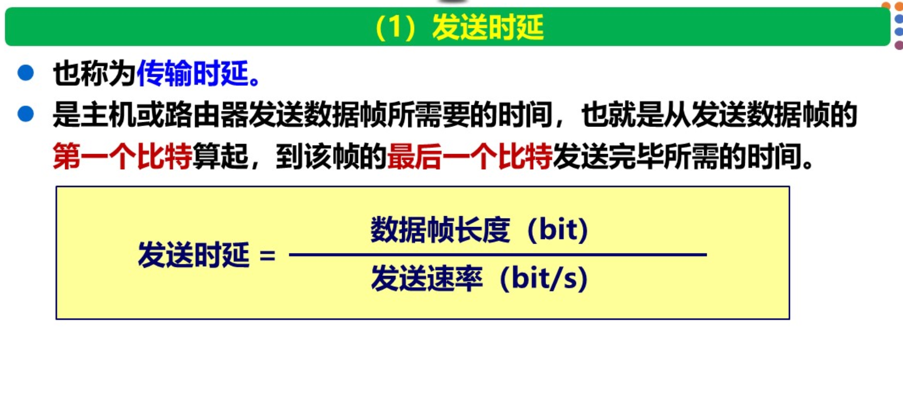
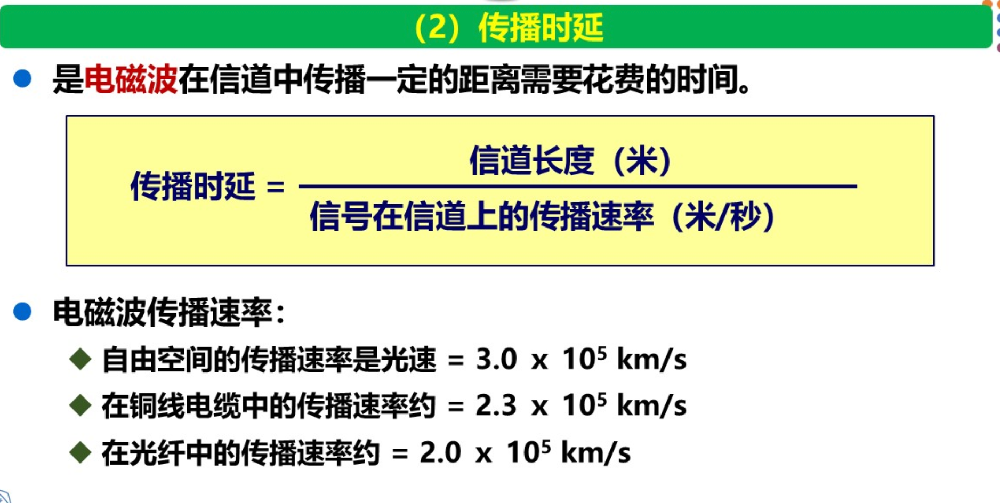
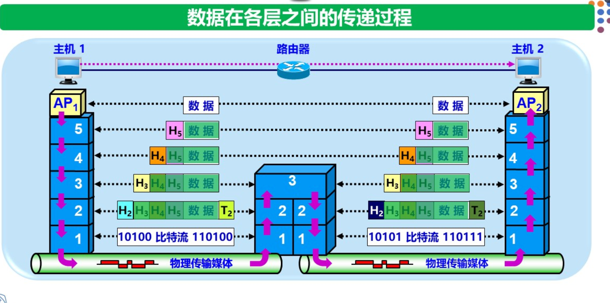

# 第一章 概述

## 1.1 计算机网络在信息时代中的作用

21世纪的重要特征是数字化、网络化和信息化，这是一个以网络为核心的信息时代。计算机网络在信息时代中扮演着至关重要的角色，其中**互联网（Internet）** 已成为最重要的基础设施。

目前，我们常说的“三网”包括：
- **电信网络**：主要提供电话、电报等服务
- **有线电视网络**：主要提供电视广播服务
- **计算机网络**：核心功能是数据通信和资源共享

近年来，“三网融合”的趋势日益明显，但由于涉及多方面的利益和行政管辖权问题，目前尚未完全实现。

**互联网的两个重要基本特点**：
1. **连通性**：使上网用户之间可以方便、经济地交换信息，无论距离多远，仿佛彼此的计算机直接连通一样
2. **共享**：即资源共享，包括信息共享、软件共享、硬件共享等

---

## 1.2 互联网概述

### 1.2.1 网络的网络

**计算机网络**（简称网络）由若干**结点（node）** 和连接这些结点的**链路（link）** 组成。结点可以是计算机、集线器、交换机或路由器等设备。

**重要概念区分**：

| 术语                          | 含义     | 特点                                                         |
| ----------------------------- | -------- | ------------------------------------------------------------ |
| **internet（互连网）**        | 通用名词 | 泛指由多个计算机网络互连而成的网络，通信协议可任意选择，不一定使用TCP/IP |
| **Internet（互联网/因特网）** | 专用名词 | 指当前全球最大的、开放的、由众多网络相互连接而成的特定互连网，**必须采用TCP/IP协议族**，前身是美国的ARPANET |

**网络与互联网的关系**：网络把许多计算机连接在一起，而互联网则把许多网络通过路由器连接在一起。与互联网相连的计算机常称为**主机**。

### 1.2.2 互联网基础结构发展的三个阶段

互联网的基础结构经历了三个阶段的演进，这三个阶段在时间划分上并非截然分开，而是有部分重叠。

**第一阶段（1969—1990）：从单个网络ARPANET向互连网发展**
- 1969年，美国国防部创建了第一个分组交换网ARPANET（最初只是单个分组交换网，并非互连的网络）
- **1983年**，TCP/IP协议成为ARPANET上的标准协议，使得所有使用此协议的计算机都能利用互连网相互通信——**这一年通常被认为是互联网的诞生时间**
- 1990年，ARPANET正式关闭

**第二阶段（1985—1993）：建成三级结构的互联网**
- 1985年起，美国国家科学基金会（NSF）围绕六个大型计算机中心建设**NSFNET**
- 三级结构：**主干网 → 地区网 → 校园网（企业网）**
- 这种三级网络覆盖了全美国主要的大学和研究所

**第三阶段（1993—至今）：形成全球范围的多层次ISP结构的互联网**
- 1993年开始，美国政府资助的NSFNET逐渐被若干个商用的互联网主干网替代
- 产生新名词：**互联网服务提供者（ISP）**，如中国电信、中国联通、中国移动等
- 多层次ISP结构：主干ISP → 地区ISP → 本地ISP
- **万维网（WWW）** 的开发成为互联网指数级增长的主要驱动力

### 1.2.3 互联网的标准化工作

1992年，互联网不再归美国政府管辖，成立了**互联网协会（ISOC）**。其下设技术组织**互联网体系结构委员会（IAB）**，负责协议开发管理。IAB下设两个工程部：
- **互联网工程部（IETF）**：研究短期或中期的工程问题
- **互联网研究部（IRTF）**：研究长期问题（协议、应用、体系结构等）

**制定互联网正式标准的三个阶段**：

1. **互联网草案**：有效期6个月，此时还不是RFC文档
2. **建议标准**：从此阶段开始成为RFC文档（可免费下载、评论）
3. **互联网标准**：经长期检验后分配标准编号

> **注**：RFC（Request For Comments，请求评论）是互联网标准的发布形式，所有RFC文档均可从互联网免费下载，但只有极少部分能成为互联网标准。

---

## 1.3 互联网的组成

互联网由**边缘部分**和**核心部分**两大部分组成：

```
┌─────────────────────────────────────────┐
│              互联网                      │
├─────────────────┬───────────────────────┤
│   边缘部分       │     核心部分           │
│   （主机）       │  （网络和路由器）       │
│   用户直接使用    │  为边缘部分提供服务     │
└─────────────────┴───────────────────────┘
```

### 1.3.1 互联网的边缘部分

边缘部分由连接在互联网上的所有**主机**（称为**端系统**）组成，包括：个人电脑、手机、网络摄像头、大型计算机（服务器）、ISP等。

**核心理解**：我们常说的"主机A和主机B通信"，实际上是指**运行在主机A上的某个进程**和**运行在主机B上的某个进程**进行通信。

**端系统之间的两种通信方式**：

#### 1. 客户-服务器方式（C/S方式）

| 角色                 | 特点                                             |
| -------------------- | ------------------------------------------------ |
| **客户（client）**   | 服务请求方，需要知道服务器地址                   |
| **服务器（server）** | 服务提供方，可同时处理多个请求，不必知道客户地址 |

#### 2. 对等连接方式（P2P方式）

- 不严格区分服务请求方和服务提供方
- 每台主机既是客户也是服务器
- 实际上仍使用客户-服务器方式，只是角色可以互换

### 1.3.2 互联网的核心部分

核心部分为边缘部分提供连通性和交换服务。其中起特殊作用的是**路由器**，它是实现**分组交换**的关键部件，任务是**转发**收到的分组。

#### 三种交换方式对比


**1. 电路交换**

经过三个步骤：**建立连接 → 通话 → 释放连接**


特点：
- 通话期间，两个用户**始终占用**端到端的通信资源
- 适合传送大量数据和实时性要求高的数据
- **缺点**：信道利用率很低

**2. 分组交换**

采用**存储转发技术**：
- 将报文划分为等长数据段
- 每个数据段加上控制信息（首部）构成**分组**（也称为"包"）
- 分组独立选择传输路径，到达后重组

**优点**：
- 高效：动态分配带宽，逐段占用链路
- 灵活：分组独立选择路由
- 迅速：无需建立连接
- 可靠：分布式多路由，网络生存性好

**缺点**：
- 存在存储转发时延（排队）
- 分组携带控制信息产生额外开销

**3. 报文交换**

- 以整个报文为单位进行存储转发
- 基本被分组交换取代
- 比分组交换时延更大

| 交换方式 | 数据传送特点             | 适用场景           |
| -------- | ------------------------ | ------------------ |
| 电路交换 | 比特流连续直达，如同管道 | 实时语音、大数据量 |
| 报文交换 | 整个报文逐段存储转发     | 基本淘汰           |
| 分组交换 | 分组流水线式存储转发     | 互联网核心         |

---

## 1.4 计算机网络在我国的发展

（本节内容为了解性质，主要包括：）
- 1994年，中国正式接入互联网
- 主要ISP：中国电信、中国联通、中国移动
- 中国教育和科研计算机网（CERNET）等重要网络

---

## 1.5 计算机网络的类别

### 1.5.1 计算机网络的定义

计算机网络没有精确统一的定义。本书的定义：计算机网络主要是由一些**通用的、可编程的硬件**互连而成的，这些硬件并非专门用来实现某一特定目的，能够传送多种不同类型的数据，并能支持广泛和日益增长的应用。

### 1.5.2 几种不同类别的计算机网络

**1. 按网络的作用范围分类**：

| 类型       | 英文 | 作用范围       | 特点                     |
| ---------- | ---- | -------------- | ------------------------ |
| 广域网     | WAN  | 几十到几千公里 | 远程网，互联网核心       |
| 城域网     | MAN  | 5~50公里       | 覆盖一个城市             |
| 局域网     | LAN  | 约1公里        | 校园、企业网             |
| 个人区域网 | PAN  | 约10米         | 个人设备无线连接（WPAN） |

**2. 按网络的使用者分类**：
- **公用网**：电信公司建造，按规定缴费即可使用
- **专用网**：特定部门（军队、铁路、银行等）专用，不对外开放

**3. 接入网（AN）**：
- 又称本地接入网或居民接入网
- 用于将用户连接到互联网
- 支持散户接入，速率相对较低

---

## 1.6 计算机网络的性能

### 1.6.1 计算机网络的性能指标

#### 1. 速率
- 数据的传送速率，也称**数据率**或**比特率**
- 单位：bit/s（b/s，bps）
- 通常指额定速率或标称速率，而非实际速率


#### 2. 带宽
有两种不同含义：
- **频域含义**：信号具有的频带宽度，单位Hz
- **时域含义**：网络信道传送数据的能力，即单位时间内可通过的最高数据率，单位bit/s
- **本质相同**：带宽越宽，最高数据率越高

#### 3. 吞吐量
- 单位时间内通过某个网络（或信道、接口）的**实际**数据量
- 受网络带宽或额定速率限制

#### 4. 时延（重点）
时延是指数据从网络一端传送到另一端所需的总时间，由以下四部分组成：

| 时延类型     | 计算公式                          | 影响因素           | 发生位置   |
| ------------ | --------------------------------- | ------------------ | ---------- |
| **发送时延** | 数据帧长度(bit) / 发送速率(bit/s) | 数据长度、发送速率 | 发送器内部 |
| **传播时延** | 信道长度(m) / 电磁波传播速率(m/s) | 距离、介质         | 传输信道   |
| **处理时延** | —                                 | 路由器处理能力     | 路由器     |
| **排队时延** | —                                 | 网络通信量         | 路由器队列 |



**总时延** = 发送时延 + 传播时延 + 处理时延 + 排队时延

> **注意**：小时延的网络优于大时延的网络。在某些情况下，低速率但小时延的网络可能优于高速率但大时延的网络。

#### 5. 时延带宽积

**时延带宽积 = 传播时延 × 带宽**（单位：bit）

**物理意义**：表示链路可容纳的比特数量，又称为**以比特为单位的链路长度**。可想象为一个圆柱形管道：管道的长度是传播时延，截面积是带宽，体积就是时延带宽积。

#### 6. 往返时间RTT
- 从发送方发送完数据到收到来自接收方的确认所经历的总时间
- 有效数据率 < 发送速率

#### 7. 利用率
- **信道利用率**：某信道有百分之几的时间被利用（有数据通过）
- **网络利用率**：全网络信道利用率的加权平均值

**重要公式**：\( D = \frac{D_0}{1 - U} \)

其中，\( D_0 \) 表示网络空闲时的时延，\( D \) 表示当前时延，\( U \) 为利用率。

> **结论**：利用率越高，时延越大。利用率过高会产生非常大的时延，甚至导致网络拥塞。

### 1.6.2 计算机网络的非性能特征

- 费用（速率越高费用越高）
- 质量
- 标准化
- 可靠性
- 可扩展性和可升级性
- 易于管理和维护

---

## 1.7 计算机网络体系结构

### 1.7.1 计算机网络体系结构的形成

**背景**：
- 1974年，IBM宣布了**系统网络体系结构（SNA）**
- 其他公司也相继推出各自的体系结构
- 不同公司设备难以互相连通

**OSI参考模型**：
- 1977年，国际标准化组织（ISO）提出**开放系统互连基本参考模型（OSI/RM）**
- 1983年形成正式文件
- **七层协议体系结构**
- **结果**：理论研究成果丰硕，但市场化失败（没有厂商生产符合OSI标准的产品）

**TCP/IP体系结构**：
- 美国国防部提出
- **四层体系结构**
- **结果**：市场竞争成功，全球最大、覆盖最广的互联网使用TCP/IP

### 1.7.2 协议与划分层次

**网络协议**（简称协议）：为进行网络中的数据交换而建立的规则、标准或约定。

**协议的三个组成要素**：

| 要素     | 含义                                     |
| -------- | ---------------------------------------- |
| **语法** | 数据与控制信息的结构或格式               |
| **语义** | 需要发出何种控制信息，完成何种动作及响应 |
| **同步** | 事件实现顺序的详细说明                   |

**分层的必要性**：
- 计算机网络是非常复杂的系统
- "分层"可将庞大复杂的问题转化为若干较小的局部问题
- 各层之间独立、灵活性好、结构可分割、易于实现和维护、促进标准化

### 1.7.3 具有五层协议的体系结构

本书采用**五层协议的体系结构**进行讲解（综合OSI七层和TCP/IP四层的优点）：

| 层序 | 层名           | 主要任务                                       | 数据单元                | 主要协议/技术        |
| :--: | -------------- | ---------------------------------------------- | ----------------------- | -------------------- |
|  5   | **应用层**     | 通过应用进程间交互完成特定网络应用             | 报文                    | HTTP, SMTP, DNS, FTP |
|  4   | **运输层**     | 向两台主机中进程之间的通信提供通用数据传输服务 | TCP报文段/UDP用户数据报 | TCP, UDP             |
|  3   | **网络层**     | 为分组交换网上的不同主机提供通信服务           | IP数据报                | IP, ICMP, IGMP       |
|  2   | **数据链路层** | 实现两个相邻节点之间的可靠通信                 | 帧                      | PPP, 以太网          |
|  1   | **物理层**     | 透明的传输比特流                               | 比特                    | RJ-45, 光纤          |

**各层详细说明**：

1. **物理层**：最底层，传输单位是比特。通过传输介质发送和接收二进制比特流，定义机械、电气、功能和过程特性。

2. **数据链路层**：将网络层的IP数据报组装成**帧**，在两个相邻节点间传送。实现**封装成帧**、**透明传输**和**差错检测**三大功能。

3. **网络层**（网际层/IP层）：负责**路由选择**（生成转发表）和**分组转发**（根据转发表转发分组）。使用IP协议，数据单元称为**IP数据报**。

4. **运输层**：提供**端到端**的通信服务。主要协议：
   - **TCP**（传输控制协议）：面向连接、可靠、数据传输单位是报文段
   - **UDP**（用户数据报协议）：无连接、尽最大努力、不可靠、数据传输单位是用户数据报

5. **应用层**：最高层，通过应用进程间交互完成特定网络应用。常见协议：**HTTP**（万维网）、**SMTP**（电子邮件）、**DNS**（域名解析）、**FTP**（文件传输）等。

### 1.7.4 实体、协议、服务和服务访问点

| 术语                  | 定义                                           |
| --------------------- | ---------------------------------------------- |
| **实体**              | 任何可发送或接收信息的硬件或软件进程           |
| **协议**              | 控制两个（或多个）对等实体进行通信的规则的集合 |
| **服务**              | 下层通过层间接口向上层提供的操作               |
| **服务访问点（SAP）** | 同一系统中相邻两层的实体交换信息的地方         |

**重要理解**：
- **协议是"水平的"**：控制对等实体之间的通信
- **服务是"垂直的"**：下层通过接口向上层提供服务
- 使用本层服务的实体只能看见服务，不能看见下层协议（下层协议对上层实体是**透明**的）


### 1.7.5 TCP/IP的体系结构

TCP/IP并不单指TCP和IP两个协议，而是指互联网通信所使用的**整个TCP/IP协议族（protocol suite）**。

TCP/IP的体系结构以IP协议为核心，IP是实现异构网络互连的关键。

---

## 本章重要概念总结

1. 互联网的两个基本特点：**连通性**和**共享**
2. **internet**（互连网）与**Internet**（互联网）的区别在于是否特指使用TCP/IP协议的全球网络
3. 互联网由**边缘部分**（主机，用户直接使用）和**核心部分**（路由器和网络，提供服务）组成
4. 互联网核心采用**分组交换**技术，具有高效、灵活、迅速、可靠的优点
5. 主要性能指标：**速率、带宽、吞吐量、时延、时延带宽积、RTT、利用率**
6. 总时延 = 发送时延 + 传播时延 + 处理时延 + 排队时延
7. 协议三要素：**语法、语义、同步**
8. 五层体系结构：**应用层 → 运输层 → 网络层 → 数据链路层 → 物理层**
9. 协议是"水平的"，服务是"垂直的"

---

**参考文献**：谢希仁《计算机网络》（第8版），电子工业出版社，2021年