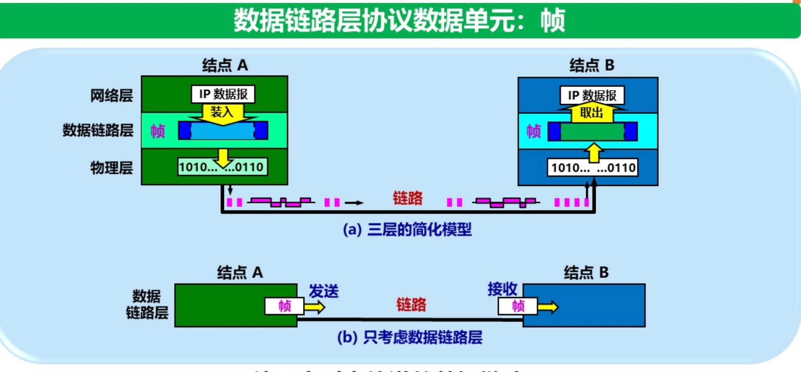
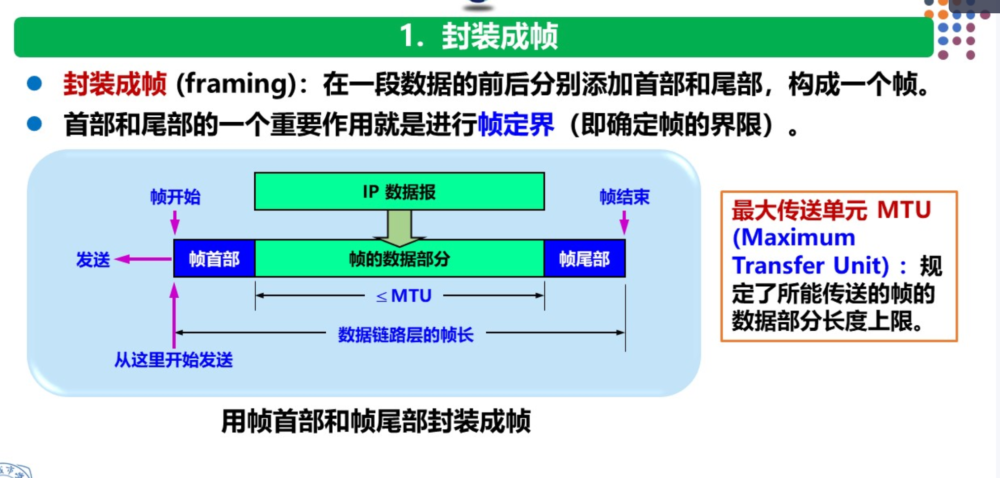
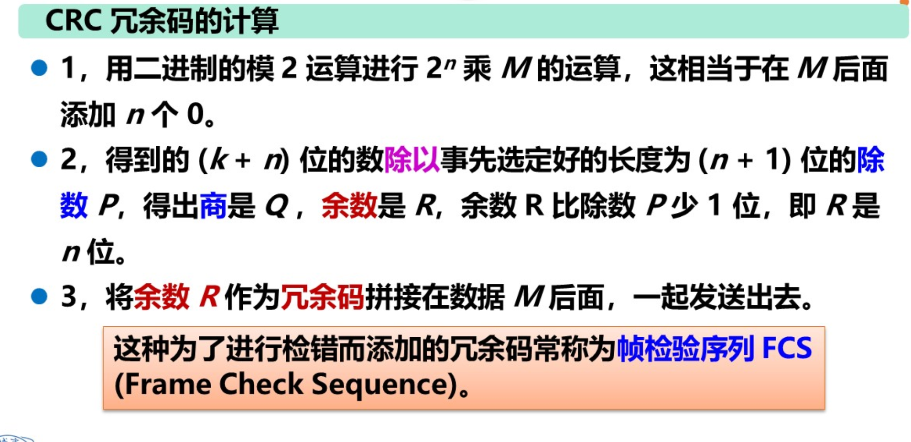
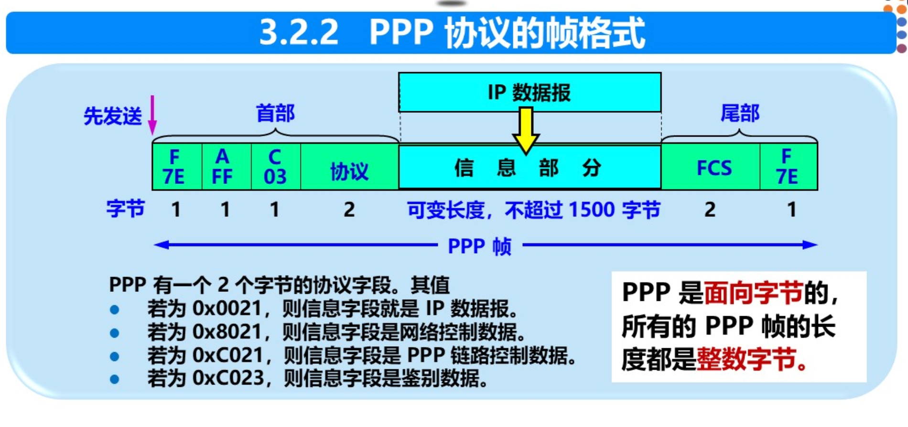

# 第三章 数据链路层

## 3.1 使用点对点信道的数据链路层

数据链路层使用的信道主要有两种类型：
- **点对点信道**：使用一对一的点对点通信方式
- **广播信道**：使用一对多的广播通信方式

本章首先讨论点对点信道，然后讨论广播信道。

### 3.1.1 数据链路和帧

#### 1. 链路（Link）
**链路**是指从一个结点到相邻结点的一段物理线路（有线或无线），而中间没有任何其他的交换结点。

#### 2. 数据链路（Data Link）
当需要在一条线路上传输数据时，除了物理线路外，还必须有一些必要的通信协议来控制这些数据的传输。**数据链路** = 物理链路 + 实现协议的硬件和软件。

常用的网络适配器（网卡）就包含了数据链路层和物理层的功能。因此，**数据链路层**在物理层提供服务的基础上向网络层提供服务，其最基本的服务是将来自网络层的IP数据报**封装成帧**，可靠地传输到相邻结点的网络层。

**数据链路层像一条数字管道**——发送端将数据送入管道，接收端从管道另一端取出数据。

#### 3. 帧（Frame）
**帧**是数据链路层的数据传送单元。数据链路层把网络层交下来的IP数据报构成帧发送到链路上，以及把接收到的帧中的数据取出并上交给网络层。

### 3.1.2 三个基本问题

数据链路层协议有许多种，但基本问题都是三个：**封装成帧**、**透明传输**和**差错检测**。

#### 1. 封装成帧（Framing）

封装成帧就是在IP数据报的前后分别添加**首部**和**尾部**，这样就构成了一个帧。首部和尾部的一个重要作用就是进行**帧定界**——确定帧的界限。

不同的数据链路层协议，其帧的首部和尾部包含的信息各不相同，但通常都包含**帧开始符**和**帧结束符**。

**MTU（最大传送单元）**：每一种数据链路层协议都规定了所能传送的帧的数据部分长度上限，即IP数据报的最大长度。以太网的MTU为1500字节。

#### 2. 透明传输（Transparent Transmission）

**透明**在计算机网络中是一个很重要的概念：某一个实际存在的事物看起来好像不存在一样。

对于数据链路层来说，**透明传输**是指：无论什么样的比特组合的数据，都能按照原样没有差错地通过这个数据链路层。

**问题**：如果数据中的某个字节的二进制代码恰好和帧定界符（如SOH或EOT）相同，数据链路层就会错误地判断帧的边界。

**解决方法——字节填充（字符填充）**：

- **发送端**：在数据中出现帧定界符之前插入一个**转义字符**（ESC，其十六进制编码为1B）
- **接收端**：收到数据后，删除这个插入的转义字符，把后面的字符当作普通数据处理
- 如果数据中本身也出现了转义字符"ESC"，则在前面再插入一个"ESC"

#### 3. 差错检测（Error Detection）

在通信过程中，比特在传输过程中可能会产生差错：1变成0，或0变成1，这称为**比特差错**。

**循环冗余检验（CRC）**：

CRC是数据链路层广泛使用的检错技术。

**工作原理**：

1. 发送端和接收端**事先约定**一个n位的除数（生成多项式对应的除数）
2. 发送端在m位数据后面加上n位的冗余码（称为**帧检验序列FCS**），使整个(m+n)位代码能被除数整除
3. 接收端用相同的除数去除收到的(m+n)位代码
   - 若余数为0：接受该帧
   - 若余数不为0：认为帧在传输中出错，丢弃该帧

**冗余码的计算方法**：
- 在m位数据后面加n个0（n比除数位数少1）
- 用该数除以除数（模2除法，即异或运算），得到n位余数即为FCS
- 将这n位余数替换原来的n个0，得到发送的帧

**重要说明**：
- CRC检错技术仅能做到"无差错接受"——凡是接收端接受的帧，都以极大概率认为没有传输错误
- **但这并不意味着可靠传输**——可靠传输需要数据链路层向上提供"无差错、不丢失、不重复"的服务
- CRC只能检测到错误，无法纠正错误
- 传输差错还包括**帧丢失、帧重复、帧失序**等问题，这些需要更高层的协议（如TCP）来处理

---

## 3.2 点对点协议（PPP）

点对点协议PPP（Point-to-Point Protocol）是目前使用最广泛的点对点数据链路层协议。

### 3.2.1 PPP协议的特点

#### 1. PPP协议应满足的要求

| 要求               | 说明                                                         |
| ------------------ | ------------------------------------------------------------ |
| **简单**           | 这是首要要求，数据链路层的协议越简单越好                     |
| **封装成帧**       | 必须能规定帧的边界                                           |
| **透明性**         | 必须保证数据传输的透明性                                     |
| **多种网络层协议** | 能够在同一条物理链路上同时支持多种网络层协议（IP、IPX等）    |
| **多种类型链路**   | 能够在多种类型的链路上运行（串行、并行、光缆等）             |
| **差错检测**       | 能够检测接收到的帧中的差错，并立即丢弃有差错的帧             |
| **检测连接状态**   | 能自动检测链路是否处于正常工作状态                           |
| **最大传送单元**   | 必须为每种点对点链路设置MTU的标准默认值                      |
| **网络层地址协商** | 必须提供一种机制使两个网络层实体能够知道或配置彼此的网络层地址 |
| **数据压缩协商**   | 必须提供一种方法来协商使用数据压缩算法                       |

#### 2. PPP协议不需要的功能

- **纠错**：PPP协议只进行检错，不进行纠错
- **流量控制**：由TCP层负责
- **序号**：PPP协议不提供序号，也不确认
- **多点线路**：PPP只支持点对点
- **半双工或单工链路**：PPP只支持全双工

### 3.2.2 PPP协议的组成

PPP协议有三个组成部分：

1. **一个将IP数据报封装到串行链路的方法**：PPP既支持异步链路（无奇偶检验的8比特数据），也支持面向比特的同步链路

2. **一个用来建立、配置和测试数据链路连接的链路控制协议LCP（Link Control Protocol）**：通信双方可协商一些选项

3. **一套网络控制协议NCP（Network Control Protocol）**：支持不同的网络层协议，如IP、OSI的网络层等

### 3.2.3 PPP协议的帧格式

PPP帧的首部和尾部分别为4个字段和2个字段。

#### 帧格式结构：

| 标志 F | 地址 A | 控制 C | 协议  | 信息部分（IP数据报） | FCS   | 标志 F |
| ------ | ------ | ------ | ----- | -------------------- | ----- | ------ |
| 1字节  | 1字节  | 1字节  | 2字节 | 不超过1500字节       | 2字节 | 1字节  |

**各字段含义**：

| 字段           | 内容                                               | 说明                         |
| -------------- | -------------------------------------------------- | ---------------------------- |
| **标志字段 F** | 0x7E (01111110)                                    | 表示一个帧的开始或结束       |
| **地址字段 A** | 0xFF (11111111)                                    | 实际不起作用（点对点）       |
| **控制字段 C** | 0x03 (00000011)                                    | 实际不起作用                 |
| **协议字段**   | 如0x0021（IP数据报）、0xC021（LCP）、0x8021（NCP） | 指明信息部分是什么协议的数据 |
| **信息部分**   | IP数据报                                           | 长度可变，但不超过MTU        |
| **FCS**        | CRC检验序列                                        | 2字节或4字节                 |

#### 透明传输问题的处理

**1. 异步传输（字节填充）**：

当信息字段中出现与标志字段0x7E相同的字节时，PPP采用字节填充法：
- 将0x7E转换为两个字节：(0x7D, 0x5E)
- 将0x7D（转义字符）转换为(0x7D, 0x5D)
- 将ASCII码的控制字符（数值小于0x20）前面加0x7D并改变该字符

**2. 同步传输（零比特填充）**：

在同步传输（一连串的比特连续传送）中，PPP采用**零比特填充**法：
- 发送端：扫描整个信息字段，每发现5个连续的1，立即在后面插入一个0
- 接收端：每发现5个连续的1，就把后面的0删除

这种方法保证了信息字段中不会出现6个连续的1，因此不会与标志字段（01111110）混淆。

### 3.2.4 PPP协议的工作状态

PPP协议的链路状态转换过程：

1. **链路静止**：物理层没有准备好
2. **链路建立**：物理层准备好后，进入链路建立状态，LCP进行协商（配置选项、最大接收单元、鉴别协议等）
3. **鉴别**：若需要身份鉴别，则进入鉴别状态
4. **网络层协议**：NCP配置网络层（分配IP地址等）
5. **链路打开**：数据传输
6. **链路终止**：数据传输完毕或出现故障，终止链路

---

## 3.3 使用广播信道的数据链路层

广播信道可以进行一对多的通信。局域网使用的就是广播信道。

### 3.3.1 局域网的数据链路层

#### 局域网的特点和优点

**局域网（LAN）**：在较小的地理范围内，利用通信线路将许多数据设备连接起来，实现资源共享和数据通信。

**局域网的主要优点**：
1. 具有广播功能，可很方便地共享资源
2. 便于系统扩展和逐渐演变
3. 可靠性、可用性、 survivability 提高

#### 局域网拓扑结构

| 拓扑结构   | 特点                                           |
| ---------- | ---------------------------------------------- |
| **星形网** | 通过中心设备连接，目前最常用（以太网多用星形） |
| **环形网** | 数据单向传输，令牌环网为代表                   |
| **总线网** | 所有节点共享一条总线，传统以太网使用           |

#### 媒体共享技术

在广播信道中，多个站点共享同一信道，需要解决**信道争用**问题。主要有两种技术：

| 技术                             | 特点                                                         |
| -------------------------------- | ------------------------------------------------------------ |
| **静态划分信道**                 | 频分复用、时分复用、波分复用、码分复用等，不适合局域网（不灵活） |
| **动态媒体接入控制（多点接入）** | 又分为：                                                     |
| └ **随机接入**                   | 所有用户随机发送，产生碰撞时需重传（以太网使用）             |
| └ **受控接入**                   | 用户不能随机发送，需服从控制（如多点线路探询、轮询），现已较少使用 |

#### 以太网的两个标准

- **DIX Ethernet V2**：最早的以太网标准
- **IEEE 802.3**：IEEE 802委员会制定的标准（与V2差别很小）

#### 适配器（网卡）

计算机与外界局域网连接需要通过**网络适配器**（Network Adapter），即俗称的**网卡**。

**适配器的功能**：
- 进行串行/并行转换
- 对数据进行缓存
- 在计算机的操作系统安装设备驱动程序
- 实现以太网协议

**重要概念**：
- 适配器拥有由IEEE分配的**全球唯一MAC地址**（6字节，48位）
- 适配器能够识别**单播地址**（一对一）、**广播地址**（一对所有）和**多播地址**（一对部分）
- 适配器从网络上每收到一个MAC帧，首先用硬件检查MAC帧中的目的地址：
  - 若发往本站，则收下并交给上层协议
  - 否则丢弃
- 适配器通常还实现**帧的差错检测**（CRC）

### 3.3.2 CSMA/CD协议

**CSMA/CD（载波监听多点接入/碰撞检测）**是以太网使用的最重要的随机接入协议。

#### 1. 基本概念

| 缩写   | 全称                | 含义                                               |
| ------ | ------------------- | -------------------------------------------------- |
| **CS** | Carrier Sense       | 载波监听：发送前先检测总线上是否有其他计算机在发送 |
| **MA** | Multiple Access     | 多点接入：多台计算机以多点接入方式连接在一根总线上 |
| **CD** | Collision Detection | 碰撞检测：边发送边监听，看是否有其他站也在发送     |

#### 2. 要点

CSMA/CD协议的要点可以概括为**"先听后说，边听边说，冲突停发，随机重发"**：

1. **先听后说**：发送数据前先检测信道
   - 若信道空闲，立即发送
   - 若信道忙，持续检测直到信道空闲

2. **边听边说**：发送过程中持续检测信道
   - 发送适配器边发送边监听

3. **冲突停发**：检测到碰撞立即停止发送
   - 检测到冲突后，发送"强化冲突"的短信号（32或48比特），让所有站都知道发生了冲突

4. **随机重发**：等待一段随机时间后再重新尝试

#### 3. 争用期（冲突窗口）

**争用期**是以太网中一个关键的时间参数：
- 以太网规定争用期长度为 **51.2μs**
- 对应于10 Mbit/s以太网发送512比特（64字节）的时间
- 以太网规定了**最短有效帧长为64字节**：凡长度小于64字节的帧都是因冲突而异常中止的无效帧

**争用期的物理意义**：从发送数据开始到检测到碰撞的最长时间，等于以太网端到端往返传播时延的2倍（即2τ）。

#### 4. 二进制指数退避算法

当检测到碰撞后，适配器使用**二进制指数退避算法**决定重传时机：

1. 确定基本退避时间 = 2τ（争用期）
2. 定义参数k = min(重传次数, 10)
3. 从整数集合{0, 1, 2, ..., 2^k - 1}中随机取一个数r
4. 重传推迟时间 = r × 基本退避时间

**特点**：
- 重传次数越大，退避时间的选择范围越大，再次发生碰撞的概率越低
- 当重传达16次仍不成功时，停止重传，向上层报告错误

#### 5. 重要规定

| 规定             | 数值   | 说明                 |
| ---------------- | ------ | -------------------- |
| **争用期**       | 51.2μs | 10 Mbit/s以太网      |
| **最短有效帧长** | 64字节 | 512比特              |
| **帧间最小间隔** | 9.6μs  | 使接收方有时间缓存帧 |

### 3.3.3 使用集线器的星形拓扑

**集线器（Hub）**是多端口转发器，工作在物理层。

**集线器的特点**：
1. 使用电子器件模拟实际电缆线的工作，从某个端口收到数据后，从除输入端口外的所有端口转发出去
2. 集线器**不进行碰撞检测**（由适配器完成）
3. 同一时刻最多允许一个站发送数据（共享带宽）
4. 集线器组成的局域网在逻辑上仍然是**总线网**，各站共享逻辑上的总线

### 3.3.4 以太网的信道利用率

定义参数：
- τ：以太网单程端到端传播时延
- T₀：帧的发送时间

**一个帧从开始发送到信道再次变为空闲的时间** = T₀ + τ

**极限信道利用率** S_max = T₀ / (T₀ + τ) = 1 / (1 + τ/T₀)

只有当参数 a = τ/T₀ 远小于1时，才能获得尽可能高的极限信道利用率。这要求以太网的**帧长不能太短**，且**距离不能太大**。

### 3.3.5 以太网的MAC层

#### 1. MAC层的硬件地址（MAC地址）

在局域网中，**硬件地址**又称为**MAC地址**或**物理地址**。

**特点**：
- MAC地址由IEEE的注册管理机构RA分配
- 长度为6字节（48位）
- 理论上可以有2⁴⁸个地址（约281万亿个）
- 地址结构：

| 前3字节（24位）    | 后3字节（24位）          |
| ------------------ | ------------------------ |
| 组织唯一标识符 OUI | 扩展标识符（由厂商分配） |

**单播、多播和广播地址**：
- **单播地址**：第一字节最低位为0
- **多播地址**：第一字节最低位为1
- **广播地址**：全1（FF-FF-FF-FF-FF-FF）

**全球管理与本地管理**：
- 全球管理地址：全球唯一，由IEEE分配
- 本地管理地址：用户自行配置

#### 2. MAC帧的格式

最常用的以太网MAC帧格式有两种：**DIX Ethernet V2标准**和**IEEE 802.3标准**。最常用的是**Ethernet V2格式**。

**V2 MAC帧格式**：

| 目的地址 | 源地址 | 类型  | 数据        | FCS   |
| -------- | ------ | ----- | ----------- | ----- |
| 6字节    | 6字节  | 2字节 | 46~1500字节 | 4字节 |

**各字段说明**：

| 字段         | 内容                                | 说明                                               |
| ------------ | ----------------------------------- | -------------------------------------------------- |
| **目的地址** | 6字节MAC地址                        | 接收站的地址                                       |
| **源地址**   | 6字节MAC地址                        | 发送站的地址                                       |
| **类型字段** | 如0x0800（IP数据报）、0x0806（ARP） | 标识上层使用的协议                                 |
| **数据字段** | IP数据报                            | 最小长度46字节（保证帧长≥64），最大1500字节（MTU） |
| **FCS**      | CRC-32检验序列                      | 检测除前导码外的整个帧                             |

**无效MAC帧**（满足以下任一条件即为无效）：
- 帧的长度不是整数个字节
- 收到的帧的FCS有差错
- 收到的帧的MAC客户数据字段的长度不在46~1500字节之间
- 对于10 Mbit/s以太网，帧的长度不在64~1518字节之间

**前导码和帧开始定界符**：在MAC帧前还有8字节的物理层前导码：
- 前7字节：前同步码（10101010...），用于同步
- 第8字节：帧开始定界符（10101011），表示后面跟着MAC帧

---

## 3.4 扩展的以太网

### 3.4.1 在物理层扩展以太网

1. **使用集线器扩展**：将多个集线器级联，形成更大的网络
   - **优点**：扩大了地理覆盖范围
   - **缺点**：冲突域变大，网络总吞吐量不增加，所有站点仍共享同一总线

2. **使用光纤扩展**：使用光纤和光纤调制解调器扩展主机与集线器之间的距离

### 3.4.2 在数据链路层扩展以太网

在数据链路层扩展局域网需要使用**网桥**或**交换机**。

#### 1. 网桥

**网桥（Bridge）**工作在数据链路层，根据MAC帧的目的地址对帧进行**转发和过滤**。

**网桥的特点**：
- 可以连接两个不同物理层/传输媒体的局域网
- 可以隔离冲突域（但不隔离广播域）
- 具有**存储转发**功能
- **优点**：过滤通信量，增大吞吐量，扩大物理范围，提高可靠性
- **缺点**：增加时延（存储转发），不隔离广播域（可能产生广播风暴）

#### 2. 交换机

**以太网交换机**实质上就是一个**多接口的网桥**，每个接口都直接与一个主机或另一个交换机相连。

**交换机的特点**：
- 每个接口处于独立的碰撞域（冲突域）
- 接口可工作在不同速率
- 具有**并行性**：多对接口可同时通信
- 采用**全双工通信**时，不使用CSMA/CD协议

#### 3. 交换机的自学习功能

交换机通过**自学习算法**建立和维护**交换表**（也称为MAC地址表或转发表）。

**自学习过程**：
1. 交换机收到帧后，记录**源地址**和**进入接口**的对应关系（学习）
2. 根据目的地址查找交换表：
   - 若找到目的地址对应的接口且不等于进入接口 → 从该接口转发
   - 若找到目的地址对应的接口但等于进入接口 → 丢弃（过滤）
   - 若找不到 → 向除进入接口外的所有接口转发（泛洪）

**交换表的时效**：交换表条目通常设置有效期（如5分钟），超时的条目将被删除。

### 3.4.3 虚拟局域网（VLAN）

**虚拟局域网VLAN**是一组逻辑上的设备和用户，这些设备和用户不受物理位置的限制，可以根据功能、部门等因素组织起来。

**VLAN的优点**：
1. **隔离广播域**：不同VLAN之间的广播不会互相传播
2. **增强安全性**：不同VLAN之间的通信需要经过路由器
3. **灵活管理**：可方便地将用户划分到不同VLAN而不受物理位置限制

**VLAN的划分方法**：
- **基于端口**：按交换机的端口划分（最常用）
- **基于MAC地址**：按站点的MAC地址划分
- **基于IP地址**：按站点的IP地址划分

**VLAN标记**：为了在交换机间传递VLAN信息，IEEE 802.1Q标准规定了VLAN标签的格式，在以太网帧中插入4字节的VLAN标签（其中12位用于VLAN标识符VID，最多支持4096个VLAN）。

---

## 3.5 高速以太网

### 3.5.1 100BASE-T以太网（快速以太网）

**快速以太网**是在双绞线上传送100 Mbit/s基带信号的星形拓扑以太网。

**特点**：
- 速率：100 Mbit/s
- 名称：100BASE-T（T代表双绞线）
- 保持最短帧长不变（64字节），但将争用期从51.2μs减为5.12μs（因为速率提高了10倍，传输同样帧长的时间也缩短为1/10）

### 3.5.2 吉比特以太网（1000 Mbit/s）

**吉比特以太网**：

- 速率：1000 Mbit/s（1 Gbit/s）
- 可使用光纤或双绞线
- 定义了两种工作模式：**全双工**（不使用CSMA/CD）和**半双工**（使用CSMA/CD）

**半双工模式下的调整**：
- 使用"载波延伸"技术：将争用期增加到512字节的发送时间
- 使用"分组突发"技术：允许一次发送多个短帧

### 3.5.3 10吉比特以太网（10 Gbit/s）与更高速

- **10GE**：10 Gbit/s，只工作在全双工模式，不使用CSMA/CD
- **40GE/100GE**：40/100 Gbit/s，主要用于数据中心、骨干网

### 3.5.4 使用以太网进行宽带接入

以太网已不仅仅是局域网技术，也广泛应用于宽带接入（如光纤宽带入户）。

---

## 本章要点速记

### 数据链路层三个基本问题
> **"装透错"**：封装成帧、透明传输、差错检测

### CRC计算（模2除法）
```
1. 在数据后加n个0（n = 除数位数 - 1）
2. 用该数除以除数（异或）
3. 余数即为FCS
4. 接收端用除数除整个帧，余数为0则接受
```

### PPP协议要点
- **首标志0x7E + 地址FF + 控制03 + 协议 + 信息 + FCS + 尾标志0x7E**
- **异步**：字节填充（0x7D转义）
- **同步**：零比特填充（5个1后插0）

### CSMA/CD要点
> **"先听后说，边听边说，冲突停发，随机重发"**
- 争用期 = 2τ = 51.2μs（10 Mbit/s）
- 最短帧长 = 64字节
- 退避算法：二进制指数退避

### 交换机的自学习
> **"学习源地址，查表转目的；找不到就泛洪"**

### MAC帧格式（V2）
| 目的 | 源   | 类型 | 数据     | FCS  |
| ---- | ---- | ---- | -------- | ---- |
| 6B   | 6B   | 2B   | 46-1500B | 4B   |

### 冲突域 vs 广播域

| 设备          | 冲突域隔离 | 广播域隔离  |
| ------------- | ---------- | ----------- |
| 集线器（Hub） | ❌          | ❌           |
| 网桥/交换机   | ✅          | ❌           |
| 路由器        | ✅          | ✅           |
| VLAN          | ✅          | ✅（可隔离） |


**参考文献**：谢希仁《计算机网络》（第8版），电子工业出版社，2021年