# 第二章 物理层

## 2.1 物理层的基本概念

物理层是计算机网络体系结构的最底层，但它不是指具体的传输媒体，也不是连接计算机的具体物理设备。物理层考虑的是**怎样才能在连接各种计算机的传输媒体上传输数据比特流**，而不是指具体的传输媒体。

**物理层的作用**：***尽可能地屏蔽掉不同传输媒体和通信手段之间的差异**，使物理层上面的数据链路层感觉不到这些差异，这样数据链路层就只需要考虑如何完成本层的协议和服务，而不必考虑网络具体的传输媒体是什么。

在物理层，数据传送的单位是**比特**。物理层的任务就是**透明地传送比特流**——也就是说，发送方发送1（或0）时，接收方应当收到1（或0）而不是0（或1）。

> **说明**：用于物理层的协议常被称为**物理层规程**。实际上，规程就是协议，只是在"协议"这个名词出现之前人们先使用了"规程"这一名词。

### 物理层协议的主要任务

物理层协议主要确定与传输媒体的接口有关的四个特性：

| 特性       | 说明                               | 举例                |
| -------- | -------------------------------- | ----------------- |
| **机械特性** | 指明接口所用接线器的形状和尺寸、引脚数目和排列、固定和锁定装置等 | RJ45接口形状、DB9接口引脚数 |
| **电气特性** | 指明在接口电缆的各条线上出现的电压的范围             | 电压值、码元宽度、电压波形     |
| **功能特性** | 指明某条线上出现的某一电平的电压的意义              | 某引脚是数据线还是控制线      |
| **过程特性** | 指明对于不同功能的各种可能事件的出现顺序             | 建立连接、传输数据、释放连接的时序 |

另外，数据在计算机内部多采用**并行传输**方式，而在通信线路上多采用**串行传输**方式，物理层必须完成传输方式的转换工作。

---

## 2.2 数据通信的基础知识

### 2.2.1 数据通信系统的模型

一个数据通信系统可划分为三大部分：

  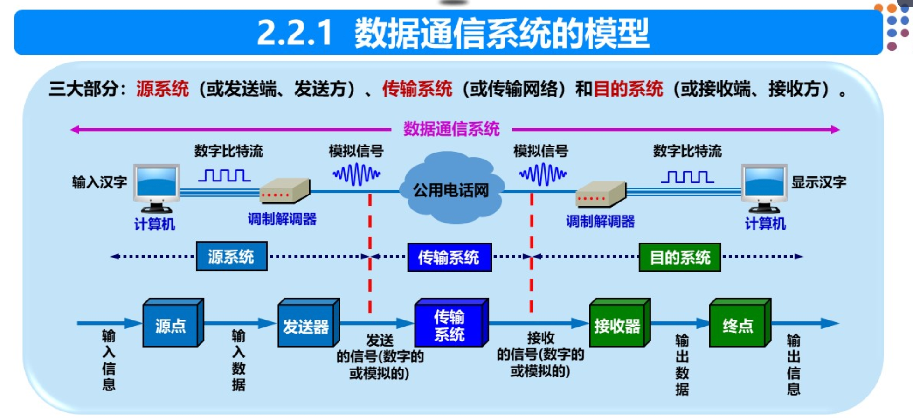

各组成部分的作用：

1. **源系统（发送端）**
   - **源点**：产生要传输的数据的设备，如计算机键盘输入产生的数字比特流，也称为源站或信源
   - **发送器**：将源点生成的数字比特流进行编码，使其能够在传输系统中传输，典型的发送器是调制器

2. **传输系统（传输网络）**
   - 负责将源系统发来的数据传输到目的系统
   - 可以是简单的传输线，也可以是复杂的网络系统

3. **目的系统（接收端）**
   - **接收器**：接收传输系统传送来的信号，并将其转换为能够被目的设备处理的信息，典型的接收器是解调器
   - **终点**：从接收器获取数字比特流并输出信息，也称为目的站或信宿

### 2.2.2 常用术语

| 术语              | 定义                                                       |     |
| --------------- | -------------------------------------------------------- | --- |
| **消息（message）** | 通信的目的是传送消息，如话音、文字、图像、视频等                                 |     |
| **数据（data）**    | 运送消息的实体，通常是有意义的符号序列                                      |     |
| **信号（signal）**  | 数据的电气或电磁表现                                               |     |
| **模拟信号**        | 代表消息的参数的取值是连续的信号，如音频电压信号                                 |     |
| **数字信号**        | 代表消息的参数的取值是离散的信号，如计算机输出的二进制信号                            |     |
| **码元（code）**    | 在使用时间域波形表示数字信号时，代表不同离散数值的基本波形。使用二进制编码时，只有两种不同的码元，分别代表0和1 |     |
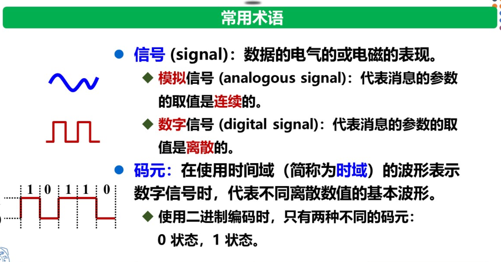
### 2.2.3 有关信道的几个基本概念

**信道（channel）**：一般用来表示向某一个方向传送信息的媒体。一条通信电路通常包含一条发送信道和一条接收信道。信道不等于电路。

#### 1. 通信方式（按信息交互方式分类）

| 通信方式         | 又称       | 特点                                   | 示例                 |
| ---------------- | ---------- | -------------------------------------- | -------------------- |
| **单向通信**     | 单工通信   | 只能有一个方向的通信，没有反方向的交互 | 无线电广播、电视广播 |
| **双向交替通信** | 半双工通信 | 通信双方都可以发送信息，但不能同时发送 | 对讲机               |
| **双向同时通信** | 全双工通信 | 通信双方可以同时发送和接收信息         | 电话、手机           |

#### 2. 基带信号与带通信号

- **基带信号**：来自信源的信号，称为基本频带信号。计算机输出的数据信号都属于基带信号，包含较多的低频成分，甚至有直流成分
- **带通信号**：经过载波调制后的信号，仅在一段频率范围内能够通过信道

#### 3. 调制（modulation）

调制可分为两大类：

| 调制类型     | 又称         | 说明                                   | 作用                |
| -------- | ---------- | ------------------------------------ | ----------------- |
| **基带调制** | 编码（coding） | 仅对基带信号的波形进行变换，把数字信号转换为另一种形式的数字信号     | 变换后的信号仍是基带信号      |
| **带通调制** | —          | 使用载波进行调制，将基带信号的频率范围搬移到较高的频段，并转换为模拟信号 | 输出带通信号，适合在模拟信道中传输 |
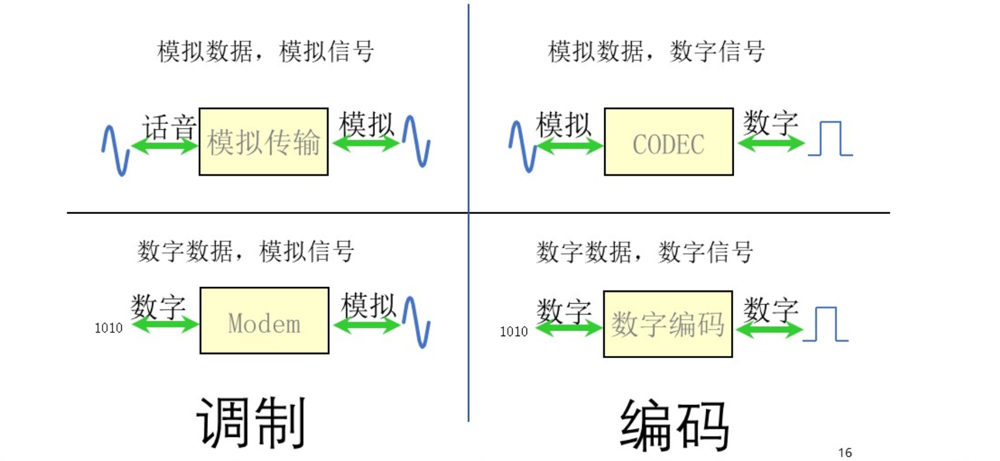
#### 4. 常用编码方式（基带调制）

| 编码方式         | 编码规则                           | 特点                     |
| ------------ | ------------------------------ | ---------------------- |
| **不归零制**     | 正电平代表1，负电平代表0                  | 无自同步能力（不能从信号波形中提取时钟频率） |
| **归零制**      | 正脉冲代表1，负脉冲代表0                  | 每个码元后信号归零              |
| **曼彻斯特编码**   | 位周期中心的向上跳变代表0，向下跳变代表1（可反过来定义）  | 具有自同步能力，频率比不归零制高       |
| **差分曼彻斯特编码** | 每一位中心处始终有跳变；位开始边界有跳变代表0，无跳变代表1 | 具有自同步能力                |
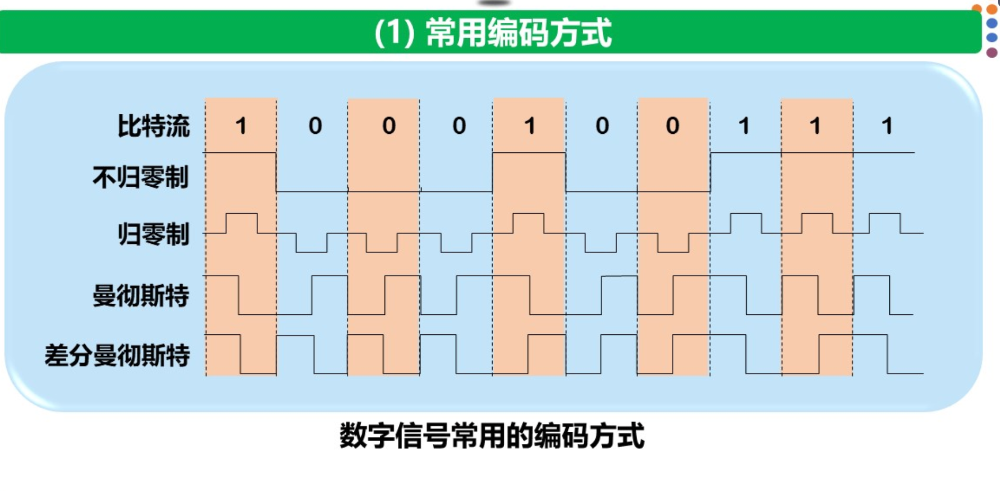
#### 5. 基本的带通调制方法

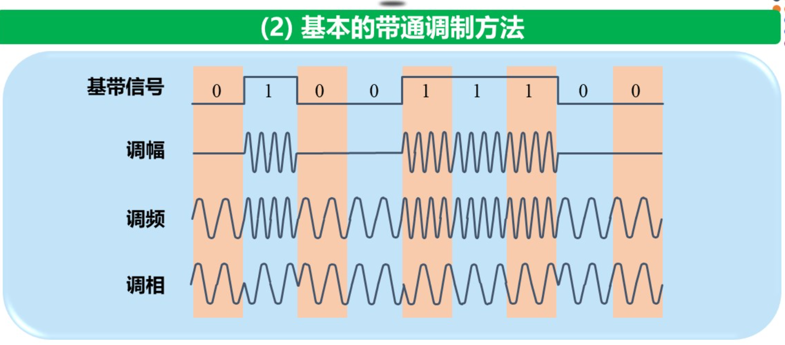

| 调制方法       | 英文                   | 原理                                   |
| ---------- | -------------------- | ------------------------------------ |
| **调幅（AM）** | Amplitude Modulation | 载波的振幅随基带数字信号变化（如0对应无载波，1对应有载波）       |
| **调频（FM）** | Frequency Modulation | 载波的频率随基带数字信号变化（如0对应频率f₁，1对应频率f₂）     |
| **调相（PM）** | Phase Modulation     | 载波的初始相位随基带数字信号变化（如0对应相位0°，1对应相位180°） |

更高效的调制方式（如**正交振幅调制QAM**）通过混合调制（调幅+调相）让一个码元携带更多比特信息，从而提高数据传输速率。

### 2.2.4 信道的极限容量

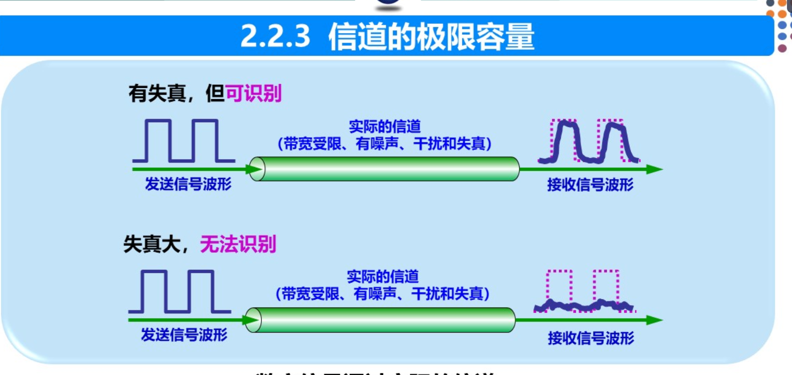

任何实际的信道都不是理想的，都不可能以任意高的速率进行传送。码元传输的速率越高、信号传输的距离越远、噪声干扰越大、传输媒体质量越差，接收端波形的失真就越严重。

限制码元在信道上的传输速率的两个主要因素：

#### 1. 信道能够通过的频率范围

实际的信道所能通过的频率范围总是有限的，信号中的许多高频分量往往不能通过信道。这会导致**码间串扰**——接收端收到的信号波形失去了码元之间的清晰界限，使接收端对码元的判决成为不可能。

**奈氏准则（Nyquist Criterion）**：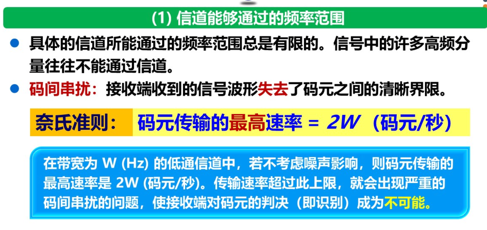
- 1924年由奈奎斯特推导得出
- 在理想低通（无噪声、带宽受限）条件下，为了避免码间串扰，**码元传输的最高速率 = 2W 码元/秒**
- 其中W为信道带宽（单位：Hz）
- 超过此上限，就会出现严重的码间串扰

#### 2. 信噪比（Signal-to-Noise Ratio）
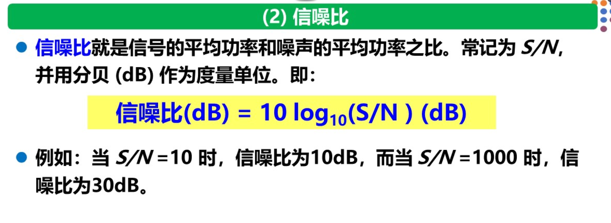

**信噪比** = 信号的平均功率 / 噪声的平均功率，记为 S/N

信噪比常用分贝（dB）作为度量单位：
- **信噪比(dB) = 10 × log₁₀(S/N)** （dB）

**香农公式（Shannon Formula）**：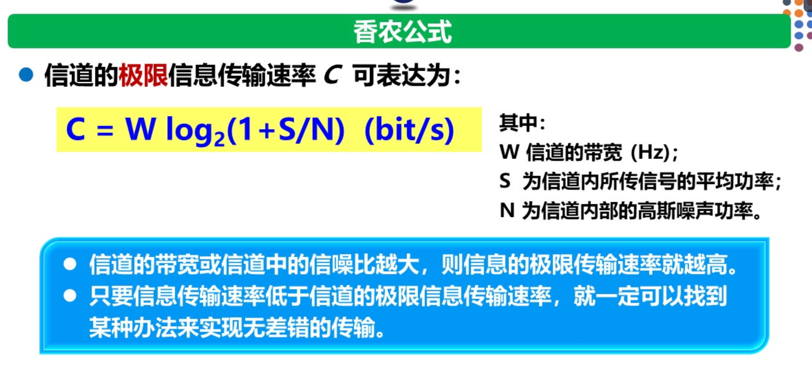
- 由信息论创始人香农推导得出
- 信道的极限信息传输速率 C = W × log₂(1 + S/N) （bit/s）

香农公式的物理意义：
1. 信道的带宽W越大，或信噪比S/N越大，则信息的极限传输速率就越高
2. 只要信息传输速率低于信道的极限信息传输速率，就一定存在某种办法来实现无差错的传输
3. 实际信道上能够达到的信息传输速率要比香农的极限传输速率低得多

**奈氏准则与香农公式的对比**：

| 比较项      | 奈氏准则                           | 香农公式                 |
| -------- | ------------------------------ | -------------------- |
| **适用条件** | 理想低通（无噪声、带宽受限）                 | 有高斯白噪声干扰的信道          |
| **给出的是** | 码元传输速率的极限                      | 信息传输速率的极限            |
| **意义**   | 指导编码技术：使每个码元携带更多比特             | 给出绝对极限：任何技术都无法超越     |
| **关系**   | 若码元传输速率超过奈氏极限，无论信噪比多高都无法正确识别码元 | 即使在奈氏极限内，信噪比也会限制信息速率 |

---

## 2.3 物理层下面的传输媒体

传输媒体（传输介质）是数据传输系统中发送器和接收器之间的物理通路。传输媒体可分为两大类：

### 2.3.1 导引型传输媒体（有线传输）

#### 1. 双绞线（Twisted Pair）

双绞线是最古老又最常用的传输媒体。把两根互相绝缘的铜导线按规则的方法绞合起来就构成了双绞线，**绞合的目的是减少对相邻导线的电磁干扰**。

| 类型         | 英文  | 特点              |
| ---------- | --- | --------------- |
| **无屏蔽双绞线** | UTP | 价格便宜，应用广泛（如以太网） |
| **屏蔽双绞线**  | STP | 抗干扰性能更好，但需要接地线  |

#### 2. 同轴电缆（Coaxial Cable）

由内导体铜质芯线、绝缘层、网状编织的外导体屏蔽层以及绝缘保护套组成。
- 具有很好的抗干扰特性，被广泛用于传输较高速率的数据
- 目前主要用在有线电视网的居民小区中

#### 3. 光缆（光纤，Fiber）

光纤通信利用光导纤维传递光脉冲进行通信：有光脉冲相当于1，无光脉冲相当于0。

| 类型         | 特点                                                   | 适用场景             |
| ------------ | ------------------------------------------------------ | -------------------- |
| **多模光纤** | 可存在多条不同角度入射的光线，光脉冲会逐渐展宽造成失真 | 近距离传输           |
| **单模光纤** | 直径减小到一个光的波长，光线一直向前传播不产生反射     | 远距离传输（衰耗小） |

**光纤通信的主要优点**：
1. **通信容量非常大**
2. **传输损耗小**，中继距离长，对远距离传输特别经济
3. **抗雷电和电磁干扰性能好**
4. **无串音干扰，保密性好**，不易被窃听或截取数据
5. **体积小、重量轻**

### 2.3.2 非导引型传输媒体（无线传输）

利用电磁波在自由空间中传播，常称为无线传输：

| 传输类型     | 频率范围        | 特点                                              |
| ------------ | --------------- | ------------------------------------------------- |
| **无线电波** | —               | 适用于长距离，可穿透建筑物                        |
| **微波**     | 300MHz ~ 300GHz | 主要使用2~40GHz，直线传播，可传输电话、图像、数据 |
| **短波**     | —               | 通信质量较差，速率较低                            |
| **卫星通信** | —               | 通信距离远，但传播时延高，保密性差                |

---

## 2.4 信道复用技术

**信道复用**：多个发送端使用同一条信道来传输信息。发送端使用**复用器**将不同的信息合起来传输，接收端使用**分用器**将信息分开。

### 2.4.1 频分复用、时分复用和统计时分复用

**1. 频分复用 FDM（Frequency Division Multiplexing）**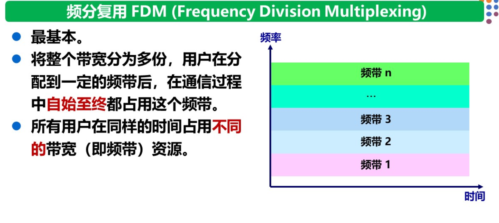
- 将整个带宽分为多份，用户被分配到一定的频带后，在通信过程中自始至终占用这个频带
- **所有用户在同样的时间占用不同的带宽资源**
- 示例：有线电视系统

**2. 时分复用 TDM（Time Division Multiplexing）**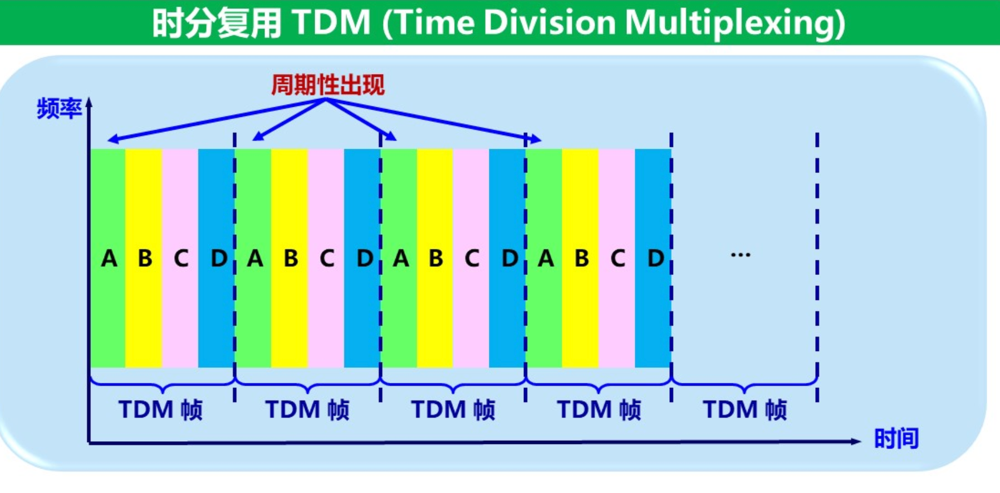
- 将时间划分为一段段等长的时分复用帧（TDM帧），每个用户在每一帧中占用固定序号的时隙
- **所有用户在不同的时间占用同样的频带宽度**
- **缺点**：当用户暂时无数据发送时，分配给该用户的时隙只能处于空闲状态，信道利用率不高

**3. 统计时分复用 STDM（Statistic TDM）**
- 是一种改进的时分复用，也称为异步时分复用
- **按需动态分配时隙**：有数据发送的用户才能占用时隙，无数据的用户被跳过
- 能明显提高信道利用率

### 2.4.2 波分复用 WDM（Wavelength Division Multiplexing）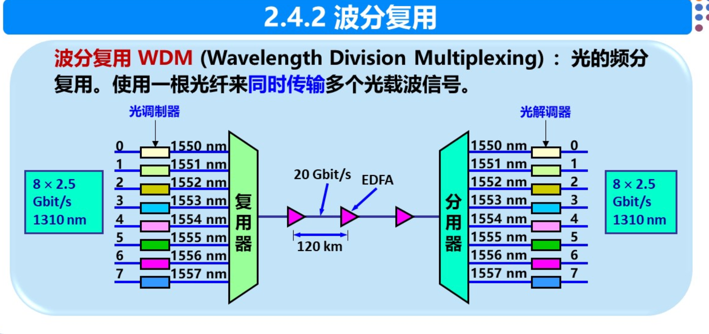

波分复用就是**光的频分复用**——使用一根光纤同时传输多个频率很接近的光载波信号。

- 随着技术的发展，一根光纤上复用的光载波信号路数越来越多，出现了**密集波分复用 DWDM**（Dense Wavelength Division Multiplexing）
- 采用DWDM技术，一根光纤的传输速率可达1.6 Tbit/s以上

### 2.4.3 码分复用 CDM（Code Division Multiplexing）

码分复用（更常用的名词是**码分多址 CDMA**）：

- 不同用户使用**不同的码片序列**，在同样的时间使用同样的频带进行通信
- 关键特性：各用户的码片序列必须**相互正交**
- 任何一个码片向量和自身的内积为1
- 任何一个码片向量和其反码的内积为-1
- 与任何其他码片向量的内积为0（正交）

**工作原理**：若发送比特1，则发送自己的码片序列；若发送比特0，则发送码片序列的反码。接收端使用相同的码片序列进行内积运算即可恢复原始数据。

**特点**：实际上是一种**扩频通信**技术，广泛应用于无线局域网中。

---

## 2.5 数字传输系统

数字通信相比模拟通信，在传输质量和经济性上都更好。光纤已成为长途干线最主要的传输媒体。

当前最主要的数字传输国际标准：
- **SDH**（同步数字序列，Synchronous Digital Hierarchy）
- **SONET**（同步光纤网，Synchronous Optical Network）
- 合称为 **SONET/SDH标准**

---

## 2.6 宽带接入技术

用户要连接到互联网，需要先连接到某个ISP（互联网服务提供者），以获得上网所需的IP地址。**宽带接入网**就是用来把用户接入到互联网的网络。

### 2.6.1 ADSL技术（非对称数字用户线）

ADSL技术用数字技术对现有的**模拟电话用户线**进行改造，使其能够承载宽带数字业务。

**关键特点**：
- **非对称**：下行带宽（从ISP到用户）远大于上行带宽（从用户到ISP），因为用户通常以下载为主
- 将4000Hz以下的频带留给传统电话，4000Hz以上用于上网
- 优点：可利用现有电话线
- 缺点：传输距离有限，不能保证固定的数据率（取决于线路质量）

**DMT调制技术**：将4kHz以上的频带划分为多个子信道，其中25个子信道用于上行，249个子信道用于下行。

除ADSL外，还有其他的**xDSL技术**（如HDSL、VDSL等），速度更快但在国内应用较少。

### 2.6.2 光纤同轴混合网（HFC网）

HFC网是基于**有线电视网**开发的一种宽带接入网：
- 将原有线电视网的同轴电缆主干部分改换为光纤（提高可靠性和质量）
- 光纤从头端连接到光纤结点，在光纤结点处光信号转换为电信号
- 用户通过**电缆调制解调器**（Cable Modem）使用HFC网
- **缺点**：数据率不确定——取决于同一段电缆上同时传送数据的用户数，用户越多速率越慢

### 2.6.3 FTTx技术

**光纤到户 FTTH（Fiber To The Home）**：
- 将光纤一直铺设到用户家庭
- 光纤进入用户家中后才把光信号转换为电信号
- 上网速率最快

其他光纤接入方式：
- **FTTB**（Fiber To The Building）：光纤到大楼
- **FTTF**（Fiber To The Floor）：光纤到楼层

多个用户通过**光配线网**（ODN）共享一根光纤干线，使用波分复用技术，上行和下行使用不同波长。

---

## 本章要点速记

### 物理层四个特性
> **"机电气过"**：机械特性、电气特性、功能特性、过程特性

### 通信方式
> **单工**（广播）、**半双工**（对讲机）、**全双工**（手机）

### 编码方式
| 编码         | 自同步 | 特点               |
| ------------ | ------ | ------------------ |
| 不归零制     | ❌      | 正1负0             |
| 归零制       | ❌      | 正脉冲1负脉冲0     |
| 曼彻斯特     | ✅      | 中心跳变表示0/1    |
| 差分曼彻斯特 | ✅      | 边界有跳变0无跳变1 |

### 两个重要公式
- **奈氏准则**（理想）：极限码元速率 = 2W Baud
- **香农公式**（有噪声）：C = W log₂(1 + S/N) bit/s

### 传输介质
> **双绞线**（UTP/STP）、**同轴电缆**、**光缆**（多模/单模）、**无线**（无线电/微波/卫星）

### 复用技术
- **FDM**：不同频率，同时传
- **TDM**：固定时隙，分时传
- **STDM**：动态时隙，按需传
- **WDM**：光的FDM
- **CDM**：不同码型，同频同时间传

### 宽带接入
- **ADSL**：电话线改造，上下行不对称
- **HFC**：有线电视网+电缆调制解调器
- **FTTx**：光纤接入，FTTH最快

**参考文献**：谢希仁《计算机网络》（第8版），电子工业出版社，2021年